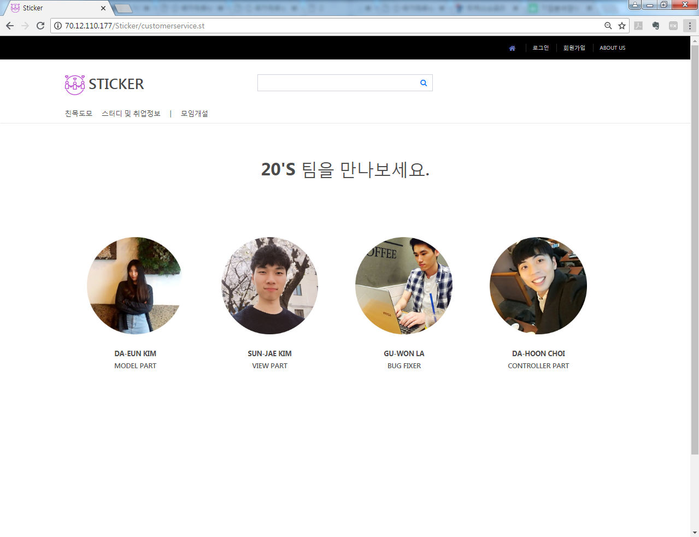

# Sticker
MVC구조에 따라 SPRING FRAMEWORK, MyBatis,Oracle 및 JSP를 활용한 모임 웹 서비스 플랫폼

## 프로젝트 소개
Sticker는 블록체인 과정 수강생들의 정보공유 및 의사소통을 위한 커뮤니티 입니다.  
수강생들이 모임이나 스터디를 만들어 친목을 교류하며 함께 공부하고 성장하기 위한 취지로 주제를 결정하였습니다.  
OnOffMix 사이트를 참고하였으며 블록체인 수강생들이 실제로 사용할 수 있도록 하였습니다.  
Spring과 MyBatis를 연습하고 웹에 더 익숙해고자 진행한 프로젝트입니다.

## 작업 환경
- 언어 : Java
- 프레임워크 : Spring
- 데이터베이스 : Oracle
- DB 프레임워크 : MyBatis
- 개발도구 : 이클립스
- 운영체제 : Windows
- 형상관리 : git, github

## 기능
- 회원 가입
- 회원 정보 수정
- 로그인, 로그아웃
- 모임 생성, 수정
- 모임 신청, 취소

## 구현 화면

## 역할분담
- 김다은 : Model 구현
- 김선재 : View 구현
- 최다훈 : Controller 구현
- 라구원 : QA 및 aws 서버 구축

## 주소
<http://sticker.ap-northeast-1.elasticbeanstalk.com/>
